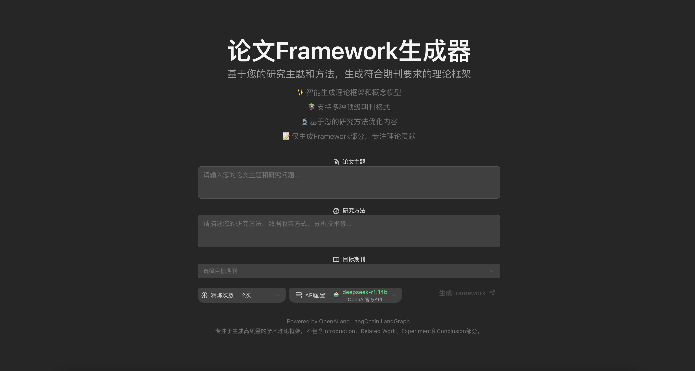
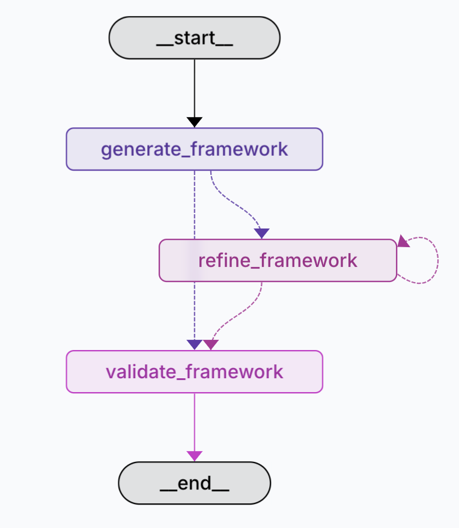

# PaperOutput-fullstack-quickstart
在项目[Google Gemini Fullstack LangGraph Quickstart](https://github.com/google-gemini/gemini-fullstack-langgraph-quickstart/)基础上进行修改的：  

1、把基于gemini的接口改为基于openai、antropic、google的接口。  
2、将原本的搜索功能改为根据主题、研究方法和参考期刊论文生成所需论文的model/Methodology部分。  

更改论文参考样例在backend/src/agent/tools_d_schemas.py中get_journal_examples的fewshot

## Getting Started

python版本为3.11以上  
需要Node.js和npm (或者yarn/pnpm)   
创建一个backend/.env文件，里面包括两个参数：OPENAI_API_BASE和OPENAI_API_KEY  
按照原始项目安装执行：  

**后端:**

```bash
cd backend
pip install .
```

 **前端:**

```bash
cd frontend
npm install
```

**运行前后端:**

```bash
make dev
```

最终的页面是(`http://localhost:5173/app`)

前端页面为  


workflow:  


